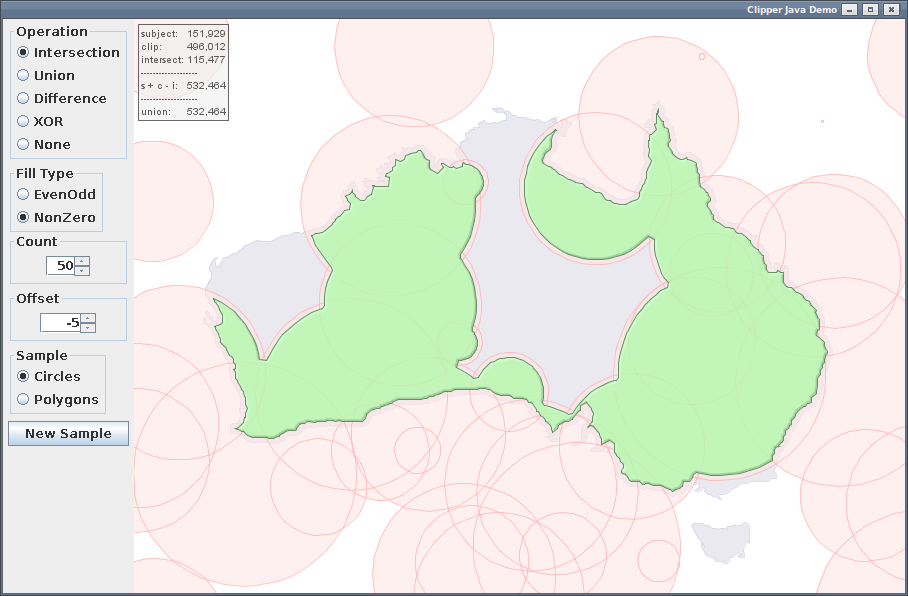

Clipper
=======

A Java port of Clipper - a polygon clipping library.

Based on the C# version clipper 5.1.6 by Angus Johnson

Porting Notes
-------------
* Int128 was implemented using BigIntegers for now as Java doesn't support unsigned longs.
* A polygon class was added instead of the using statement. `List<Polygon>` is used instead of Polygons.
* Exceptions are throw as a RuntimeException, ClipperException.
* The more complex pass by reference calls were implemented using AtomicReferences.
* The naming of public methods and parameters was changed to match the common Java style.

Usage
-----

Build with ant:

	ant jar

Sample Code
-----------

	import clipper.*;
	
	...
	
	List<Polygon> subj = new ArrayList<Polygon>();
	subj.add(new Polygon());
	subj.get(0).add(180, 200);
	subj.get(0).add(260, 200);
	subj.get(0).add(260, 150);
	subj.get(0).add(180, 150);
	
	subj.add(new Polygon());
	subj.get(1).add(215, 160);
	subj.get(1).add(230, 190);
	subj.get(1).add(200, 190);
	
	List<Polygon> clip = new ArrayList<Polygon>();
	clip.add(new Polygon());
	clip.get(0).add(190, 210);
	clip.get(0).add(240, 210);
	clip.get(0).add(240, 130);
	clip.get(0).add(190, 130);
	
	List<Polygon> solution = new ArrayList<Polygon>();
	
	Clipper c = new Clipper();
	c.addPolygons(subj, PolyType.ptSubject);
	c.addPolygons(clip, PolyType.ptClip);
	c.execute(ClipType.UNION, solution, PolyFillType.EVENODD, PolyFillType.EVENODD);
